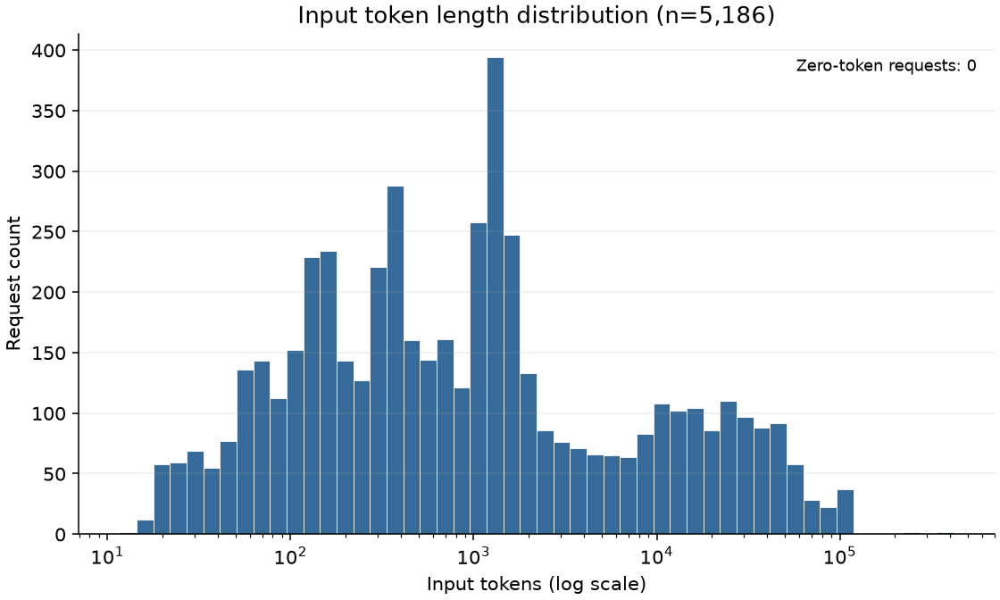
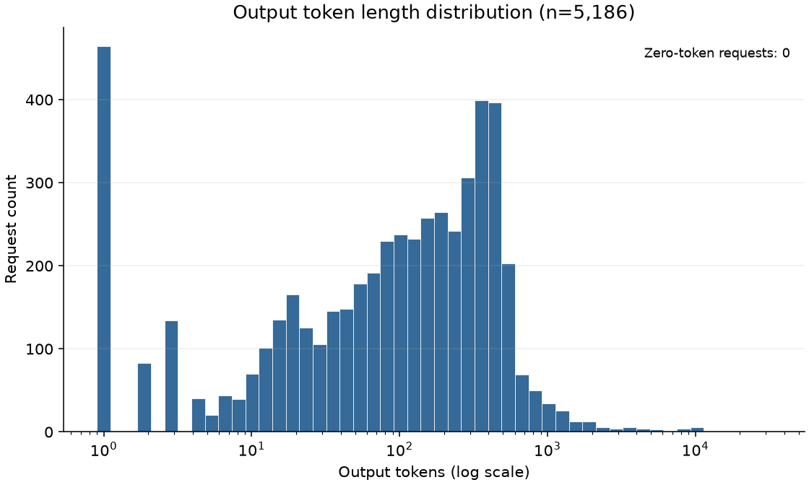
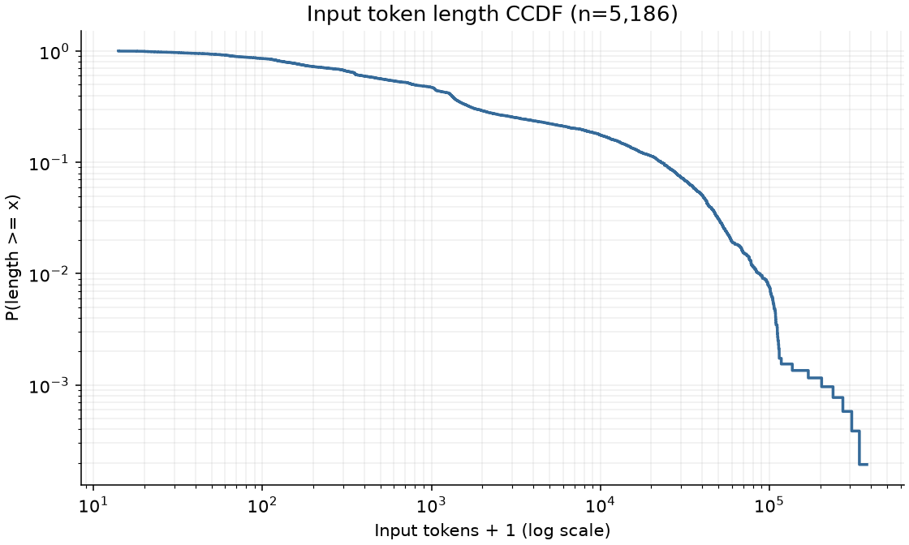
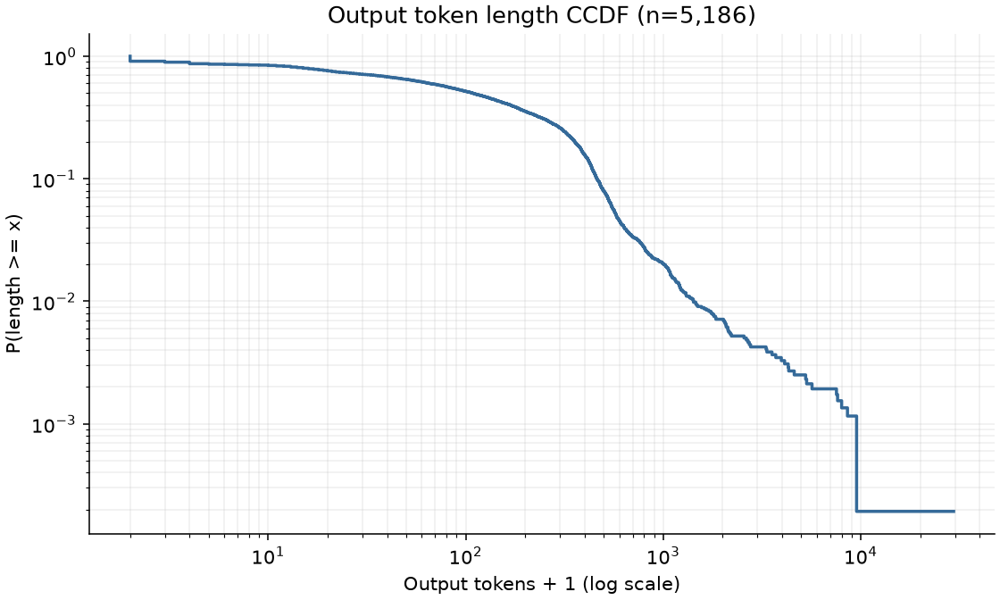
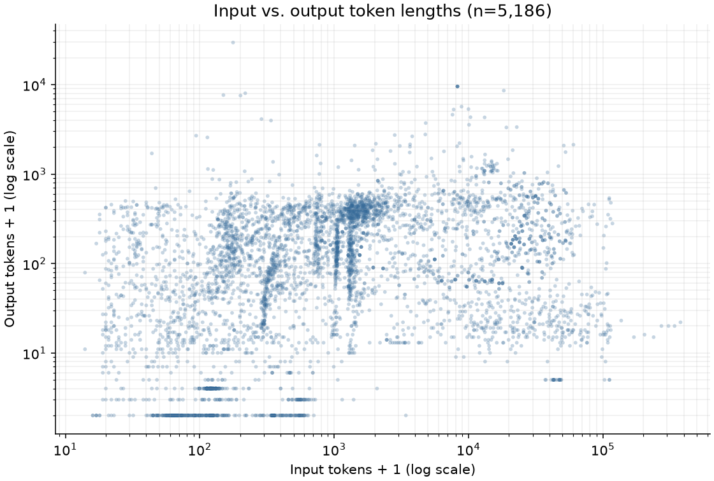

# Stage 1：Request 长度数据集报告

生成时间：2026-10-02T17:54:20.103485+08:00；运行模式：`full`。

## 数据来源与展开结果

- 原始 JSONL conversation/内部行单元数：**3,168**。
- 本次处理 conversation 数：**3,168**；成功展开 request 数：**5,186**；成功计算长度并保存数：**5,186**。
- 每个已处理 conversation 平均成功产生 **1.636995** 个 request（分母包含零样本 conversation）。
- assistant 候选数：5,778；跳过 request 数：**592**；无样本 conversation：0。
- 无效 conversation：0；tokenization 失败：0。

成功样本来源：历史 assistant 2,428 个；顶层 response 2,758 个。

真实 schema 为每行 `prompt.messages + response`。将顶层 `response` 接为最后一条 assistant，
再枚举所有 assistant；保留当前 assistant 之前的完整历史，前缀必须已有 user 且最后角色是 user 或 tool。
`conversation_id` 为从 0 开始的原始物理行号；`request_index` 为包含跳过候选的 assistant 序号，因此可以有间隙。
`source_message_index` 为补上顶层 response 后的消息位置；`response_origin` 区分 history/top_level_response。

说明文件将行称为非流式请求/回答配对，不能据此证明不同行之间互不重叠或代表独立业务会话。
本阶段遵照按原始行建立内部 conversation 的约定，不虚构业务 request_id，不跨行去重。
410 行原始历史以 assistant 结尾，顶层 response 是连续 assistant；其与最近 user 的语义配对不明确，按固定规则跳过。

## 异常、跳过与保留

跳过原因以 request 为单位，逐条定位见 `skipped_events.jsonl`：

| 原因 | 数量 |
|---|---:|
| consecutive_assistant | 410 |
| empty_or_null_assistant_content | 182 |

结构观察次数（按消息/相邻消息统计，可重叠；不等于额外丢弃样本）：

| 观察项 | 次数 |
|---|---:|
| consecutive_assistant | 410 |
| consecutive_tool | 831 |
| null_content_messages | 173 |
| list_content_messages | 46 |
| consecutive_user | 23 |

连续 user 全部保留。空/null assistant 的工具调用保留在后续历史，但不生成空文本 output 样本；
连续 assistant 不生成当前样本，也不删除已存在的历史。末尾没有 assistant 时只记录未回答尾部，不伪造 output。
list content 仅接受真实观察到的 type=text 块，按原序无分隔拼接；未知非文本块拒绝处理，不静默丢失。
工具 schema、tool_calls、tool_call_id、reasoning_content 在规范化消息中保留；异常历史会使依赖它的后续样本被跳过。

## Tokenizer 与固定配置

Tokenizer：`Qwen/Qwen3-8B`；固定 revision：`b968826d9c46dd6066d109eabc6255188de91218`。
加载类：`Qwen2Tokenizer`，is_fast=True。
仅下载显式白名单中的 tokenizer/config/chat template 文件，未下载模型权重。
用途为 **offline length construction tokenizer**，这些长度不声称等于原生产模型的真实 token 数。

Input 使用原版 Qwen chat template，固定参数：

```json
{
  "tokenize": true,
  "add_generation_prompt": true,
  "enable_thinking": false,
  "continue_final_message": false,
  "padding": false,
  "truncation": false,
  "return_tensors": null,
  "return_dict": false
}
```

每行原始 `prompt.tools` 原样传入；存在时也传入 `tool_choice`、`parallel_tool_calls`。
这些是源行级配置，统一用于该行展开出的请求；源数据不提供每个历史回合独立的 tools 配置。
后两项为 API 控制，官方模板不渲染它们；tool_call_id 等字段是否进入模板由官方模板决定。
官方模板按自身规则渲染 assistant 历史 reasoning，早于最后 user 的独立 reasoning 不会全部进入序列。
未修改模板来人为补加不渲染的字段。`enable_thinking=False` 固定了新回答的 generation prompt，不更改历史文本。

Output 单独计算 `len(tokenizer.encode(response_text, add_special_tokens=False, truncation=False))`；
只计当前 assistant content 文本，不加角色标记/EOS，不拼入独立 reasoning_content 或结构化 tool_calls。
其中 431 个成功样本的 assistant 同时包含 tool_calls，已用 `response_has_tool_calls` 标记；其 output 是文本部分长度。
Input/Output 使用同一 tokenizer；不截断、不填充；`total_tokens = input_tokens + output_tokens`。
Tokenizer 配置的 model_max_length=131,072；有 8 个 input 超过该值，仍完整计数。本阶段不运行模型，不将其作为无效或截断样本。
`message_count` 及各角色计数只统计 input context，不含当前 output，也不把 tools schema 算作消息。
全部保存样本的 `tokenization_status=ok`；失败不填 0 或估计长度，而单独写入审计。
完整参数、源文件 SHA256、tokenizer/template SHA256 与依赖版本见 `stage1_metadata.json`。

## 长度描述统计

分位数使用 linear 插值，P95 仅为描述统计。

| 指标 | input_tokens | output_tokens | total_tokens |
|---|---:|---:|---:|
| count | 5,186 | 5,186 | 5,186 |
| mean | 7,100.999 | 223.182 | 7,324.182 |
| median | 779.500 | 107.000 | 1,047.000 |
| P90 | 22,859.000 | 461.000 | 23,350.000 |
| P95 | 40,342.500 | 578.000 | 40,584.000 |
| P99 | 86,471.850 | 1,420.300 | 86,864.800 |
| max | 377,804 | 29,533 | 377,825 |

Input/Output Pearson：**0.004802**；
Spearman：**0.368254**，使用全部 5,186 个成功样本。

同一 conversation 的 request 存在历史依赖，因此相关系数这里只作描述，不报告独立样本显著性推断。

## 分布观察

是否观察到明显长尾：**是，input 和 output 均有明显右尾，input 尤为突出。** Input 的 P99 约为中位数的 110.932 倍，output 约为 13.274 倍；两个经验 CCDF 均延伸到远高于典型长度的少量样本。此结论来自本批统计与五张图的人工观察，仅说明较长的右尾，不证明属于任何特定尾部分布。

- input_tokens：均值/中位数=9.110；P99/中位数=110.932；最大值/中位数=484.675。
- output_tokens：均值/中位数=2.086；P99/中位数=13.274；最大值/中位数=276.009。

长尾观察以这些描述统计和经验分布图为依据；本报告不作幂律/EVT 拟合，也不建立任何阈值或标签。







直方图使用 token 的对数横轴；CCDF 为 P(length >= x)，横轴使用 length+1，纵轴使用对数；scatter 展示全部样本，两个横纵坐标均使用 length+1。

## 下一阶段的数据条件

**已具备进入下一阶段 Tail Detection 的长度数据条件。**
数据具有可追溯 conversation/request 键、统一 tokenizer 的 input/output/total 长度、异常审计和基础描述统计。
尾部观察对象是这批展开后的文本长度代理；含工具调用 output 的结构化负载不包含在 output_tokens 内。
如后续训练/评估，必须先按 conversation 划分，再展开或使用 request；若确认存在跨行重叠，还须先处理关联，防止泄漏。
本阶段没有训练/验证/测试划分，没有 Heavy 标签、P95 阈值、EVT/POT、分类器、Type-Heavy 或路由/调度实现。

## 复现与来源

```powershell
$py = '.\.venv\Scripts\python.exe'
& $py -m workload_profiling.stages.stage1.run --smoke
& $py -m workload_profiling.stages.stage1.run
```

Smoke 使用少量但覆盖真实 schema 的 conversation，临时输出到 cache/smoke/stage1。首次下载后，固定本地 tokenizer 可离线复跑。
默认 Parquet 不保存完整 Prompt/Response；通过源文件、conversation_id、request_index 和 reconstruct_request 回溯。

官方参考：[Qwen tokenizer 配置与模板](https://huggingface.co/Qwen/Qwen3-8B/blob/b968826d9c46dd6066d109eabc6255188de91218/tokenizer_config.json)、
[Transformers chat templating](https://huggingface.co/docs/transformers/main/en/chat_templating)。
