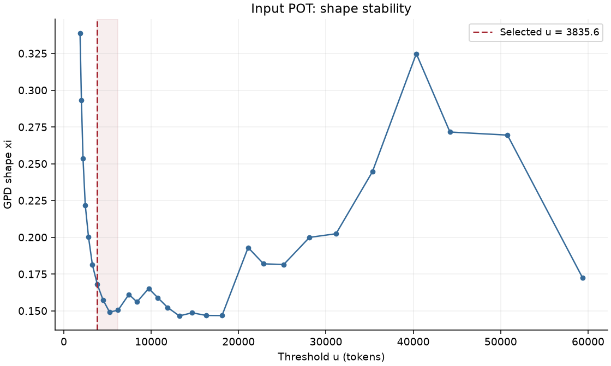
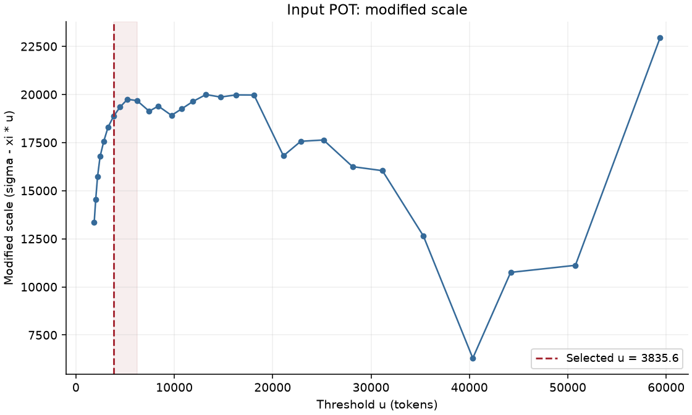
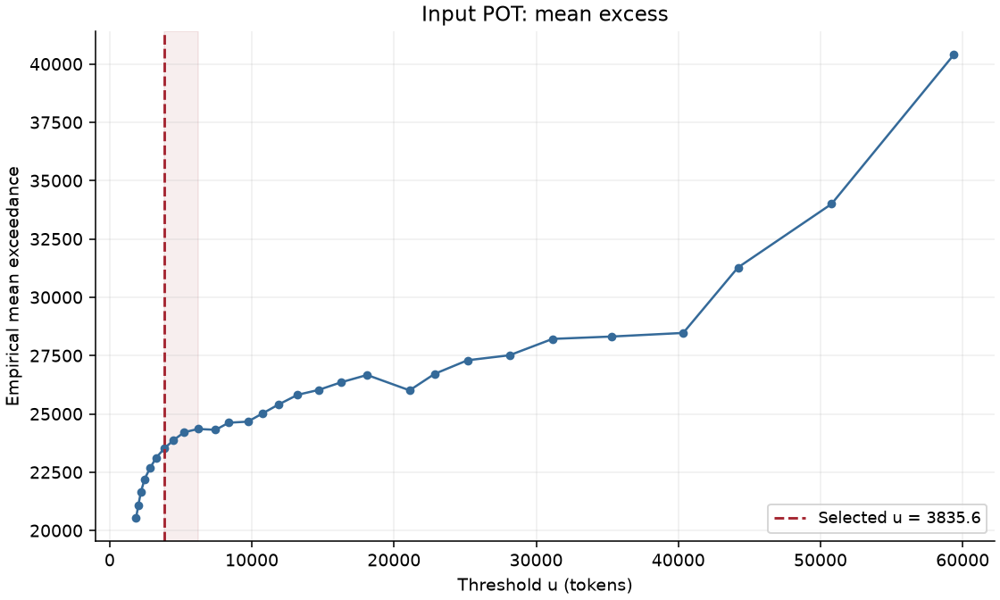
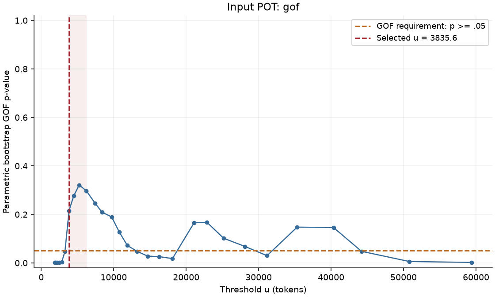
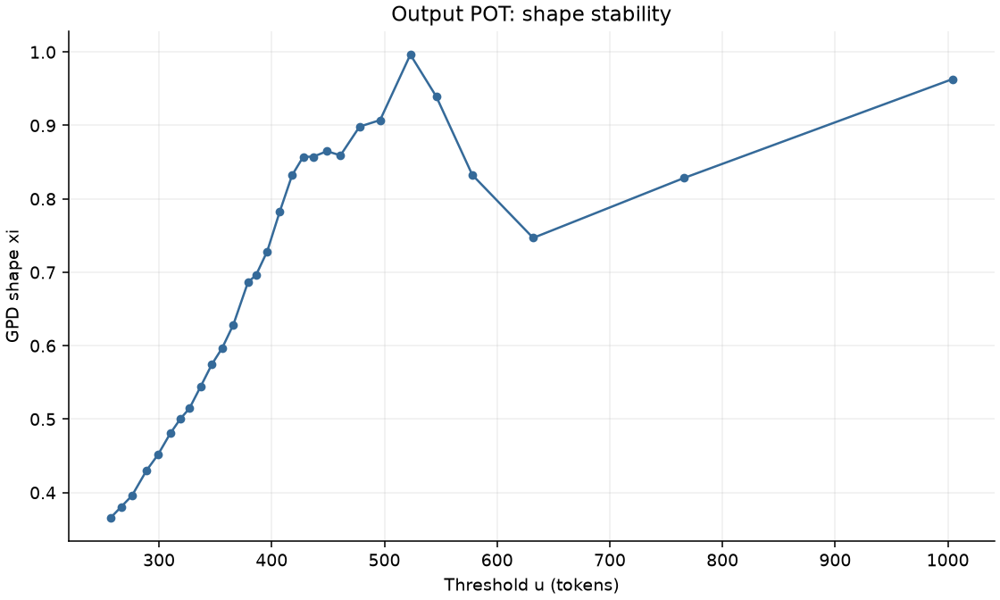
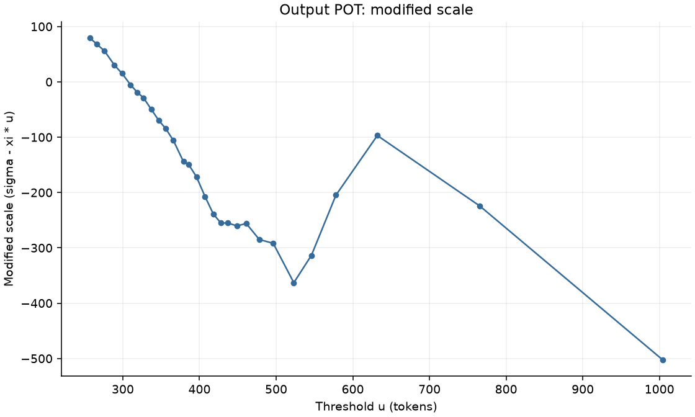
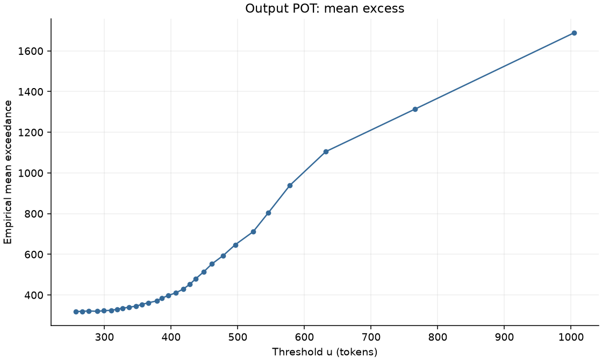
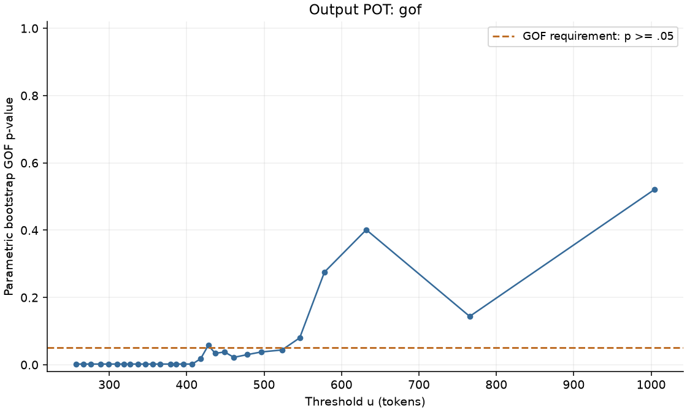

# Stage 2：Input / Output Global Tail Detection

模式：`full`；时间：2026-10-03T16:29:20.759705+08:00；request 数：5,186。

只读取 Stage 1 Parquet；没有读取 Prompt/Response 或重新 tokenization。Input/Output 分别拟合，所有 request 共用各自的全局阈值。

## 15 个问题的直接回答

1. **Input P95：40,342.500 tokens**。仅作为 baseline。
2. **Input EVT Tail Onset：3,835.600 tokens**；status=`OK`。
3. EVT empirical percentile：**75.993%**（count(X<=u)/N）。
4. EVT Tail 请求：**1,245 / 5,186，24.007%**。
5. EVT Tail 占 input-token workload：**92.465%**。

6. **Output P95：578.000 tokens**。仅作为 baseline。
7. **Output EVT Tail Onset：不可用 tokens**；status=`NO_STABLE_EVT_THRESHOLD`。
8. EVT empirical percentile：**不可用%**（count(X<=u)/N）。
9. EVT Tail 请求：**不可用 / 5,186，不可用**。
10. EVT Tail 占 output-token workload：**不可用**。

Output：当前数据不足以支持稳定的 EVT Tail Onset。没有强行选择阈值；保留 P95 baseline，EVT 标签为 null。

11. **EVT threshold bootstrap 稳定性**：

| Axis | Success | u median | u 2.5% | u 97.5% | Percentile median | Percentile 2.5% | Percentile 97.5% |
|---|---:|---:|---:|---:|---:|---:|---:|
| input | 112/200 (56.000%) | 4,138.800 | 3,198.037 | 22,050.325 | 76.996 | 73.988 | 89.997 |
| output | 35/200 (17.500%) | 428.000 | 410.250 | 521.150 | 87.061 | 85.014 | 93.039 |

区间只基于成功选择的 replicates，是算法敏感性的条件百分位区间，不包含失败 replicate，也不是未知真实 Tail Onset 的保证覆盖区间。
报告把 success<90%、u 区间相对宽度>50% 或 percentile 区间跨度>5 个百分点描述为敏感；这些描述标准不参与选择算法。

- input：阈值对 bootstrap 明显敏感或选择失败较多；u 区间相对宽度=4.555。
- output：阈值对 bootstrap 明显敏感或选择失败较多；u 区间相对宽度=0.259。

12. **P95 与 EVT 的标签重合**：

| Axis | P95 u | EVT u | P95 count / fraction | EVT count / fraction | Both | P95-only | EVT-only | Agreement | Jaccard |
|---|---:|---:|---:|---:|---:|---:|---:|---:|---:|
| input | 40,342.500 | 3,835.600 | 260 / 5.013% | 1,245 / 24.007% | 260 | 0 | 985 | 81.007% | 0.209 |
| output | 578.000 | 不可用 | 257 / 4.956% | 不可用 / 不可用 | 不可用 | 不可用 | 不可用 | 不可用 | 不可用 |

Agreement 可能被大量双方都为非 tail 的请求抬高，应与 Jaccard 一起看。

13. **四类 workload 的数量与比例**：

| 类别 | 数量 | 比例 |
|---|---:|---:|
| Normal | 不可用 | 不可用 |
| Input-tail / Prefill-heavy | 不可用 | 不可用 |
| Output-tail / Decode-heavy | 不可用 | 不可用 |
| Both-heavy | 不可用 | 不可用 |

Prefill-heavy/Decode-heavy 仅为长度尾部的 workload 名称，没有测量 GPU 开销。若任一轴 EVT 不可用，则不构造四类标签。

14. **Input-tail 与 Output-tail 的关系**：

- 交集：不可用；并集：不可用；Jaccard：不可用。
- P(Output-tail | Input-tail)：不可用。
- P(Input-tail | Output-tail)：不可用。
至少一个 EVT threshold 未获得，无法据此判断两批 EVT tail 是否相同。

15. **当前是否支持用 EVT Tail Onset 替代固定 P95？**

- input：可给出符合预设诊断的 EVT 候选，但重采样敏感，当前不足以支持稳健地替代固定 P95；保留两者对照。
- output：不支持：没有满足预设条件的持续稳定 EVT 区域，应保留 P95 作为 baseline。

## 固定方法与可复现性

网格 q=0.70,...,0.98（0.01 步长），linear quantile，按实际 u 去重并保留 quantile 范围。严格 X>u；每候选至少 100 个尾部样本且比例>=2%。
每个有效候选使用 scipy.stats.genpareto.fit(exceedances, floc=0)，检查参数有限、sigma>0、支持域和对数似然。
四个连续 unique thresholds：xi range<=0.15、CV<=0.20，modified-scale CV<=0.20，所有四个 bootstrap GOF p>=0.05。取最低合法窗口的起点，不最大化 p-value。
窗口 std 使用 ddof=0；CV 分母为 abs(mean)。abs(xi mean)<0.05 时记录 CV，但 shape 只使用 range；modified scale 均值绝对值<=1e-12 时 CV 未定义，窗口不通过。
Modified scale = sigma-xi*u，可为负值；不要求原始 sigma 恒定。MRL 线性回归记录 slope/R²，R²>=0.90 仅作辅助支持，不作否决条件。
GOF：B=500，每次 synthetic sample 重拟合 xi/sigma，p=(1+#D_b>=D_obs)/(B+1)。合成样本使用生成分布参数作为优化初值，参数仍自由重新估计。
合成数据通过 SciPy fit 的 optimizer 接口使用同一似然的解析梯度 BFGS（xi/log sigma），检查梯度与 SciPy 原似然后接受；未收敛时回退默认 Nelder-Mead。原始候选仍使用默认 scipy fit。加速不减少 GOF 次数。
外层：Input/Output 各 200 次 request length observation 重采样，仍用同样的候选网格、尾部要求、窗口规则和 GOF B。
主实验完整评估每个有效候选的 GOF；外层 bootstrap 对不影响第一个合法窗口的 GOF 短路求值，重叠候选只评估一次。这与完整选择结果一致，不降低实际评估 GOF 的 B。
固定 seed=20261003；随机流按 axis/trial/candidate 分开，不依赖进程完成顺序。结果 JSON 记录全部 200 次（smoke 为 20 次）外层选择状态。
## 解释限制

长度为离散变量，主实验使用连续 GPD 近似，不添加 jitter。ties/量化可能影响 KS，GOF 拒绝不会被强行忽略。
同一 conversation 的 request 存在依赖；按要求进行的 observation bootstrap 与 parametric GOF 都使用 iid 假设，因此这里只解释为全局长度数据上的探索性诊断与算法敏感性，不能宣称独立样本推断成立。
网格扫描与多个重叠窗口并非独立检验；p>=0.05 表示未拒绝拟合而非证明模型正确。选中一个四阈值窗口也不表示所有更高阈值永远有效。
样本为 Stage 1 离线长度代理；output_tokens 只含回答文本，不含结构化 tool_calls 或独立 reasoning。
## 诊断图










## 运行与产物

```powershell
$py = '.\.venv\Scripts\python.exe'
& $py -m workload_profiling.stages.stage2.run --smoke
& $py -m workload_profiling.stages.stage2.run
```

Smoke 仍使用完整 Stage 1 长度列，仅 bootstrap 次数改为 GOF 100 / threshold 20，临时输出在 cache/smoke/stage2。
Checkpoint 根据源 Parquet 哈希、算法文件哈希与固定配置验证；中断后同命令自动恢复，--no-resume 可强制重算。
data/processed/tail_labels.parquet 仅保存 request 键与新增 P95/EVT 可空布尔标签；未获得阈值的 EVT 标签为 null。长度保存在唯一的 request_lengths.parquet，使用 common.datasets.load_dataset('stage2') 获取完整视图。
--refresh-report 校验来源/config 后复用已完成的科学结果，重建标签和报告，不重新拟合；算法参数改变须完整重跑。
本阶段不训练分类器，不做按模型/端点阈值、预测器、统一 Heavy Score、成本建模、路由或调度，也未进入 Stage 3。

方法参考：[SciPy refit parametric bootstrap GOF](https://docs.scipy.org/doc/scipy/reference/generated/scipy.stats.goodness_of_fit.html)、
[SciPy GPD](https://docs.scipy.org/doc/scipy/reference/generated/scipy.stats.genpareto.html)、
[threshold stability / modified scale](https://lbelzile.github.io/UNIL-2025-choosing-threshold/UNIL-choosing_threshold.html)。
